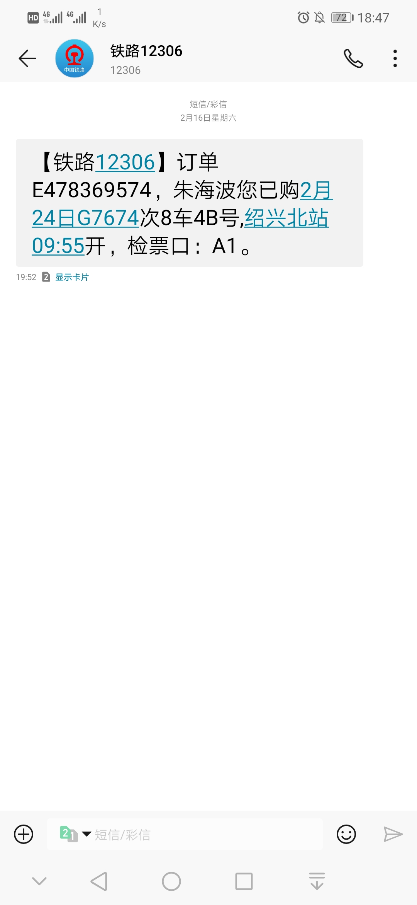
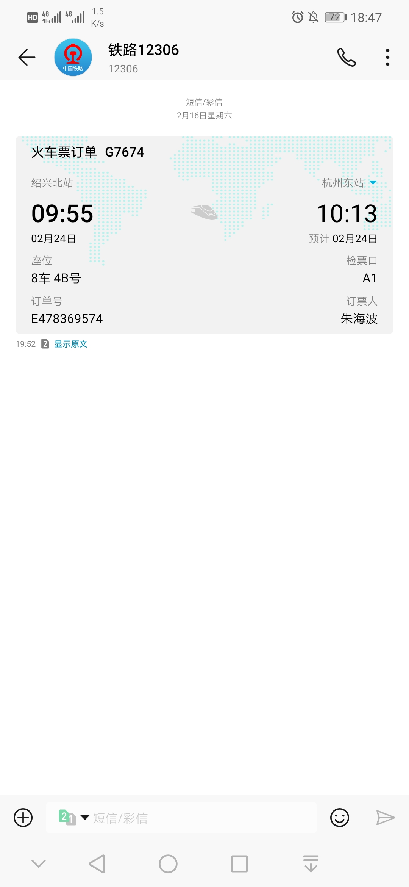

# Messages 设计概要

## 消息种类

- 通知： 运营商/银行的余额提示、快递外卖等
- 出行信息：火车票、机票、电影票等
- 验证码
- 联系人消息

其中联系人为可选分类，如关闭则联系人往来短信归入收件箱。

不同分类之间的切换由底部抽屉（bottom navigation drawer）实现：

[Navigation drawer - Material Design](https://material.io/design/components/navigation-drawer.html#bottom-drawer)

## 功能概览

- **卡片展示**：对于分类后的短信，将提取出的关键信息默认展示为卡片，并提供显示原文按钮；
- **通知汇总**：对于分类后的短信，用户可以选择是否将提取出的关键信息汇总显示在通知栏中；
- **锁屏隐藏敏感信息**：对于分类后的短信，用户可以选择是否在锁屏界面隐藏关键信息；
- **固定通知**：将特定短信临时固定在通知栏，作为待办事项；
- **验证码**：识别并自动复制或自动填充；
- **头像生成**：联系人头像自动生成，头像中内容为联系人的备注（姓名）。重要运行商等头像的生成，如中国移动、12306等；
- **骚扰拦截**：骚扰信息的识别；
- **删除恢复**：信息删除后可以在一定时间内复原；

### 卡片展示

- 结合发件人号码，按照“火车票”、“机票”、“电影票”等关键词进行正文识别及标记；
- 针对不同种类的票进行关键信息提取，如“火车票”的“车次”、“日期”、“出发站”、“检票口”等信息。

