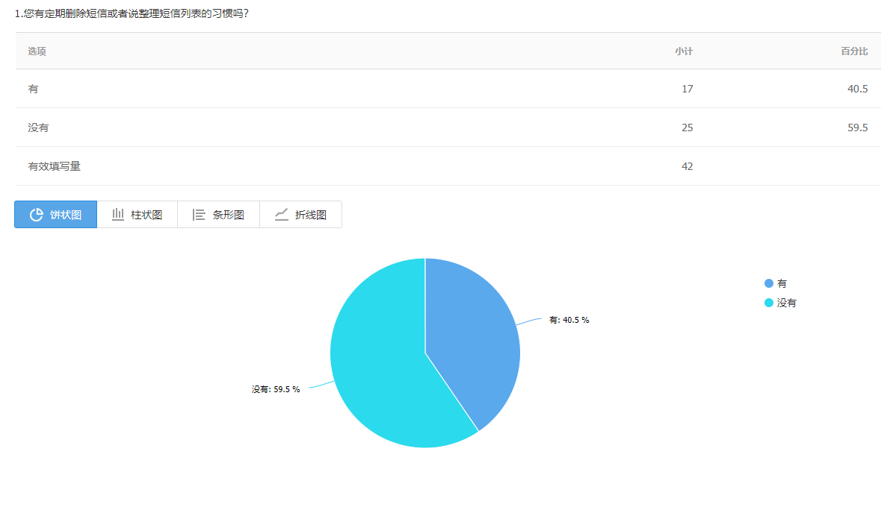
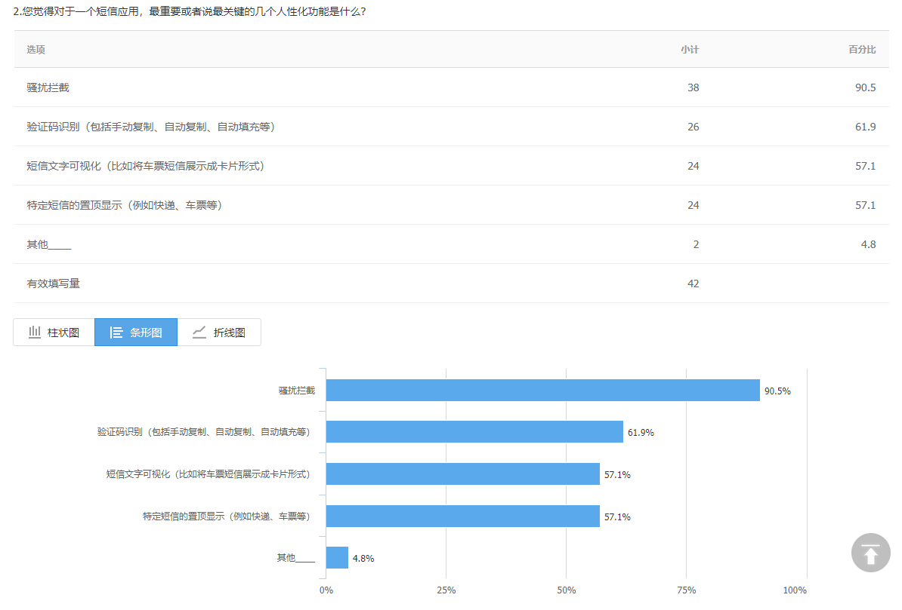
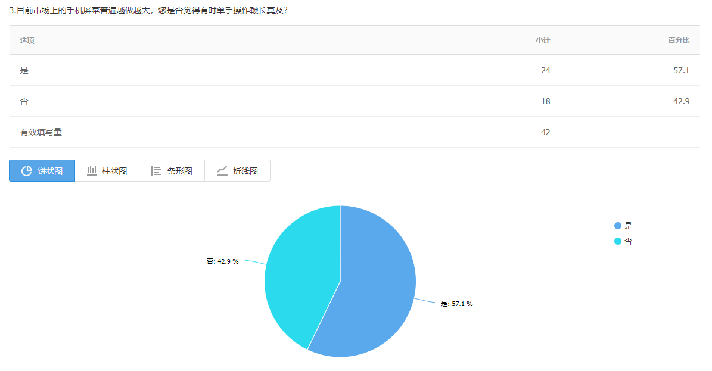
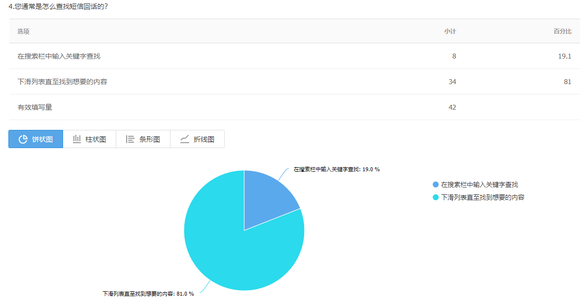
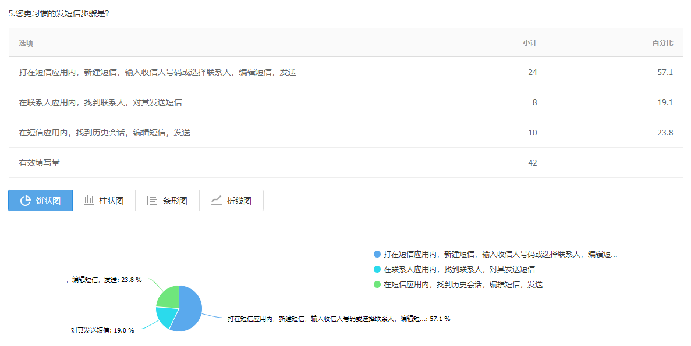
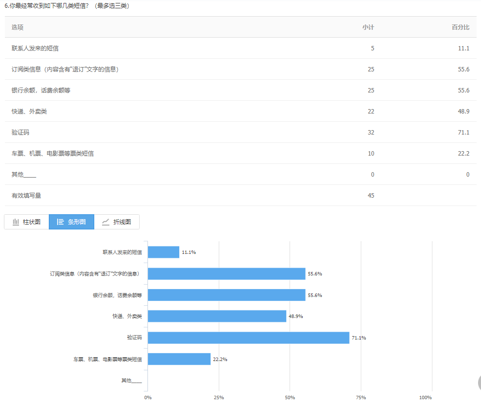
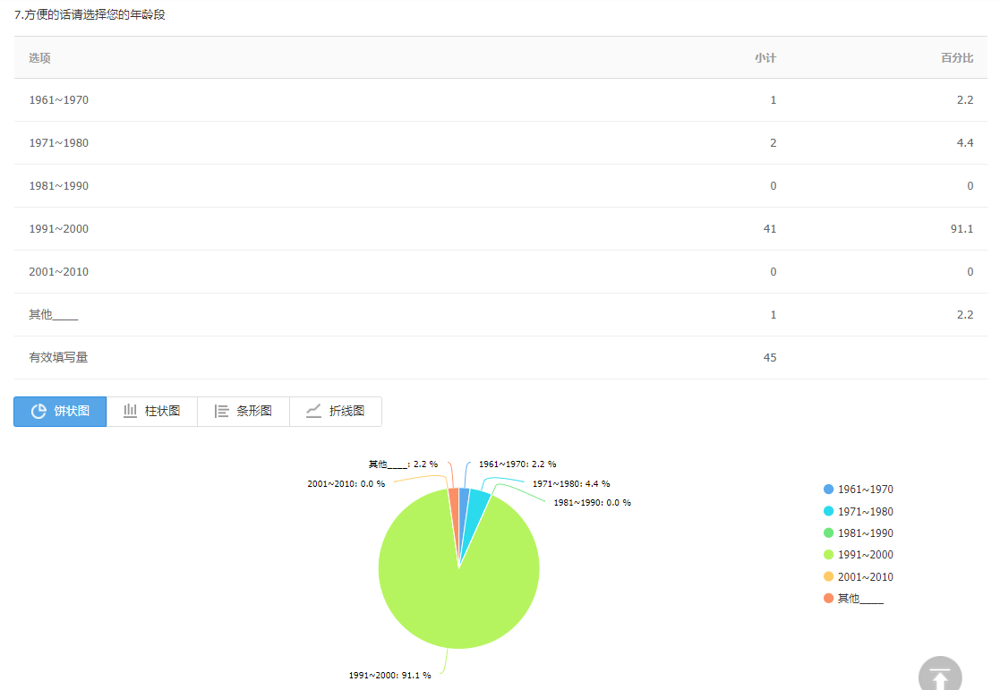
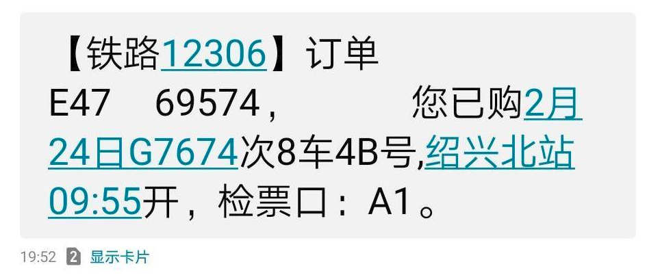
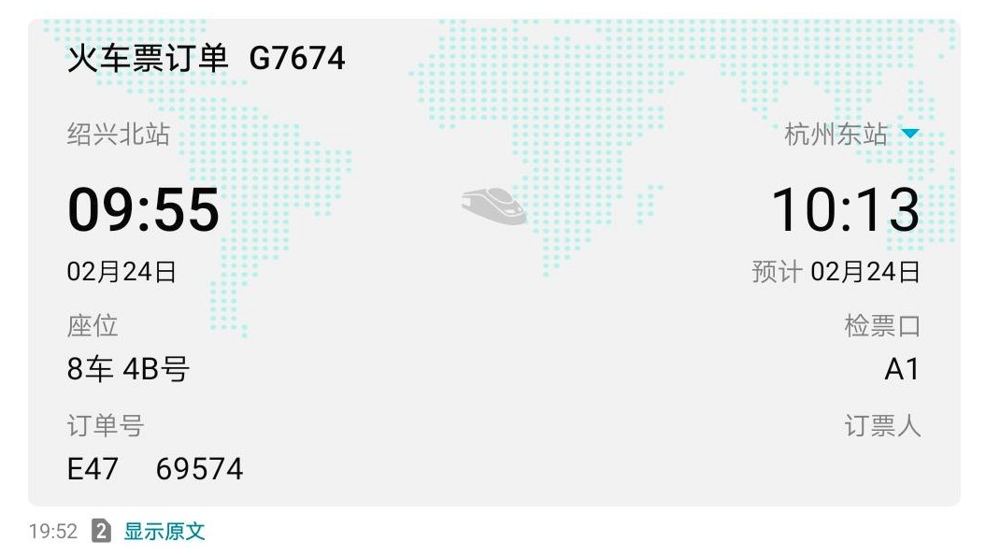

# 安卓短信应用设计概要

- [大家都会收到什么样的短信？](#大家都会收到什么样的短信？)
- [现有的短信应用存在哪些不足？](#现有的短信应用存在哪些不足？)
- [小范围的用户习惯调查统计结果](#小范围的用户习惯调查统计结果)
- [设计了哪些功能，要做出哪些完善？](#设计了哪些功能，要做出哪些完善？)

## 大家都会收到什么样的短信？

如今，用短信进行交流的使用方式已不多见。我们总结了如下这些短信类型：

- **通知**：来自银行、运营商、物流、外卖等；
- **票据**：电影票、火车票、机票等；
- **验证码**：用于验证个人身份的验证码；
- **订阅**（包含被动订阅）：促销、办卡等“回 TD 退订”短信；
- **联系人**：多为网络不便/情况紧急时使用。

## 现有的短信应用存在哪些不足？

- **拦截**：规则不够完善/不透明/不可自定义，被拦截的信息分类入口位置过深，难以检查；
- **管理**：收件箱会话数量多时，手动翻页寻找会话困难，缺少分类以及对误删短信的处理；
- **操作**：屏幕尺寸越来越长，传统的顶栏按钮/菜单难以单手操作。

## 小范围的用户习惯调查统计结果

## 设计了哪些功能，要做出哪些完善？

- **分类管理**：为特殊分类短信提供分类入口，方便查阅；
- **固定通知**：将特定短信临时固定在通知栏，作为近期待办事项；
- **误删恢复**：加入回收站设计，允许用户对误删的短信进行恢复；
- **敏感隐藏**：允许用户选择是否在锁屏界面隐藏各类敏感信息；
- **短信拦截**：完善、透明、可自定义的规则，方便的分类入口；
- **验证码处理**：识别、提取验证码并提供手动复制，自动复制、自动填充功能；
- ~~**头像生成**：读取联系人头像，对特殊号码自动设置头像（电信运营商：移动/联通/电信；12306）；~~
- ~~**信息标记**：将信息标记为“未读”，作为未来代办事项；~~
- **票类展示**：对车票/机票/船票信息，自动生成卡片视图，参考设计如下：

原文视图：

卡片视图：

